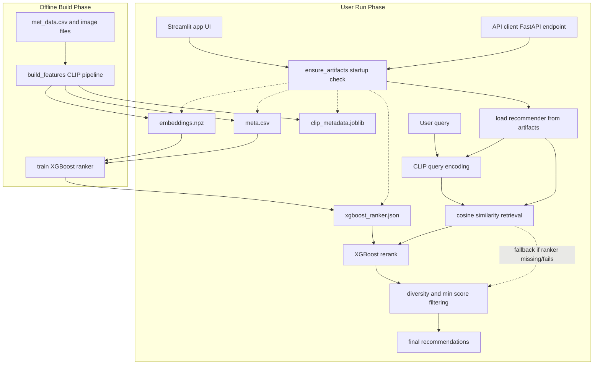

# MET Exhibition AI Curator

An academic recommendation system for themed Metropolitan Museum of Art exhibitions.

The system takes curator-style theme prompts (for example: `ancient egypt`, `religious art`, `women portrait paintings`) and returns grouped artwork recommendations with images and scores.

## Project Overview

This project was developed to support exhibition planning with a reproducible ML pipeline and an interactive interface.

Current operational pipeline:
- Retrieval backend: CLIP (text-image shared embedding space)
- Reranker: XGBoost learning-to-rank
- Serving interfaces: Streamlit UI and FastAPI endpoint

## Development Journey (Academic Context)

This repository intentionally preserves parts of earlier iterations to document project evolution.

1. Early phase: Google Vision API + text features
- The team initially used Google Vision-based image enrichment.
- That path is now deprecated for runtime use.

2. Migration phase: CLIP-based multimodal retrieval
- Retrieval moved to CLIP embeddings as the primary operational path.

3. Ranking phase: XGBoost reranker
- LightGBM was replaced by XGBoost for stage-2 ranking.

Why legacy code remains:
- This is an academic project, and retaining legacy components helps show methodology decisions and progression.
- Legacy paths are documented but not the current production/default flow.

## Current System Flow

## Operational Flow Diagram




### Offline Build and Train
1. Build features from MET metadata + images.
2. Generate CLIP artifacts (`embeddings.npz`, `meta.csv`, `tokens.json`, `clip_metadata.joblib`).
3. Train XGBoost reranker and save `xgboost_ranker.json`.

### Online Serving
1. User submits a theme query (Streamlit or API).
2. Query is encoded through CLIP retrieval path.
3. Cosine similarity retrieval generates candidates.
4. XGBoost reranks candidates when model is available.
5. Final recommendations are returned.

Fallback behavior:
- If XGBoost artifact is missing or reranker fails, app falls back to similarity-only ranking.
- This is surfaced through warnings/diagnostics.

## Legacy Components (Documented, Not Primary)

### TF-IDF backend
- Kept as a legacy baseline/fallback context for reproducibility and comparison.
- Not the primary operational retrieval path.

### Google Vision API path
- Deprecated in current runtime flow.
- You do not need to configure Vision credentials for normal project use.
- Legacy references may still appear in code/docs to preserve process history.

## Repository Structure

- `src/models/recommender.py`: retrieval + reranking + recommendation assembly
- `src/app/streamlit_app.py`: Streamlit interface
- `src/api/main.py`, `src/api/routes.py`: FastAPI service
- `scripts/build_features.py`: artifact build pipeline
- `scripts/train_ranker.py`: XGBoost ranker training
- `src/bootstrap.py`: artifact readiness checks and startup warnings
- `docs/METHODOLOGY_AND_DECISIONS.md`: methodology and rationale

## Setup

Prerequisites:
- Python 3.11+
- `uv`
- Git LFS (for image assets)

Install and sync:
```bash
python -m pip install uv
uv sync --all-extras
git lfs install
git lfs pull
```

## Quickstart

### 1. Build artifacts
```bash
make build-features
```

### 2. Train XGBoost reranker
```bash
make train-ranker
```

### 3. Run Streamlit
```bash
make streamlit
```

### 4. (Optional) Run API
```bash
make serve
```

## API Quick Test

### PowerShell (Windows)
```powershell
Invoke-RestMethod -Method Get -Uri http://127.0.0.1:8000/health
Invoke-RestMethod -Method Post -Uri http://127.0.0.1:8000/recommendations/theme -ContentType "application/json" -Body '{"theme":"ancient egypt","k":5,"min_similarity":0.2}'
```

### macOS/Linux
```bash
curl http://127.0.0.1:8000/health
curl -X POST http://127.0.0.1:8000/recommendations/theme   -H "Content-Type: application/json"   -d '{"theme":"ancient egypt","k":5,"min_similarity":0.2}'
```

## Quality Checks

```bash
make format
make lint
make type
make test
```

## Notes for Academic Reporting

This repository is meant to document both:
- The final operational system (CLIP + XGBoost), and
- The development process that led there (including deprecated/legacy paths).

For detailed rationale, limitations, and tradeoffs, see:
- `docs/METHODOLOGY_AND_DECISIONS.md`

## License

MIT
